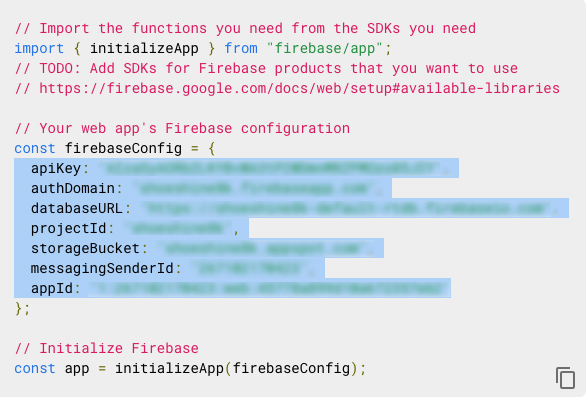

# React State

## Pre Flight Check
- Add the ui folder to your class react dashboard page.
- Have your firebase config file ready and available.


## Class Project Setup
- Drag and drop the ```ui folder``` into the class project src directory.
- Drage and drop the ```libs folder``` into your class project src directory.


## Local Firebase Config
- First copy the ```setup.env```file into the root folder of your class project.
- Rename the ```setup.env``` file to ```.env```
- Get a copy of your firebase keys from the Firebase console.
- Use the key values in the .env file you just renamed.

 


 

## Using Absolut Paths
You can configure create react app to support importing your component modules using absolute paths.  
  
In the project root folder (where the package.json file is located) create a file called jsconfig.json.  

Copy the code snippet below into the jsconfig.json file. If you have the Dev Server running you need to shut it down and restart to have the changes take effect.


```json
{
  "compilerOptions": {
    "baseUrl": "src"
  },
  "include": ["src"]
}
```
 